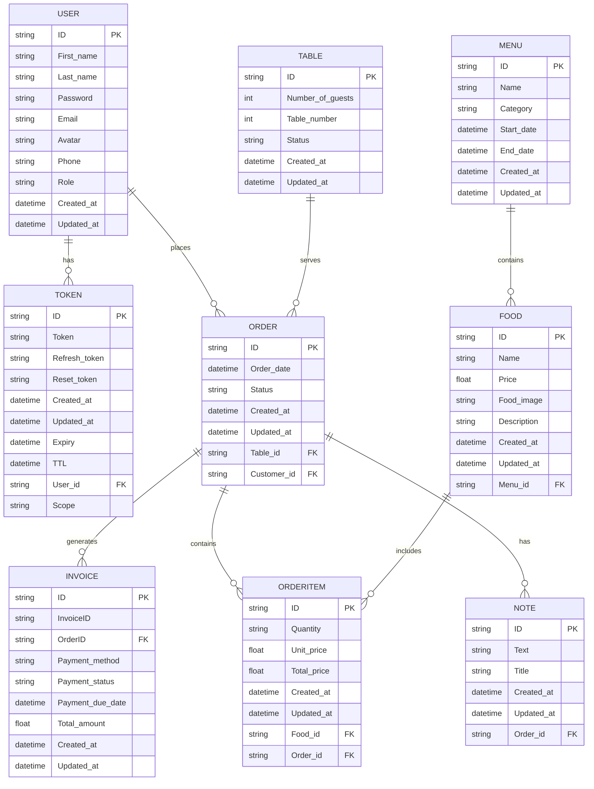

# ERD

### in plain text...

```plaintext
    [User ] 1 ----< [Token]
   |
   | 1
   |
   | 
    [Order] 1 ----< [Invoice]
    |
    | 1
    |
    | 
    [Table] 1 ----< [Order]
    |
    | 1
    |
    | 
    [OrderItem] >---- [Food] >---- [Menu]
    |
    | 1
    |
    | 
    [Order] >---- [Note]
```

---

### better...



---