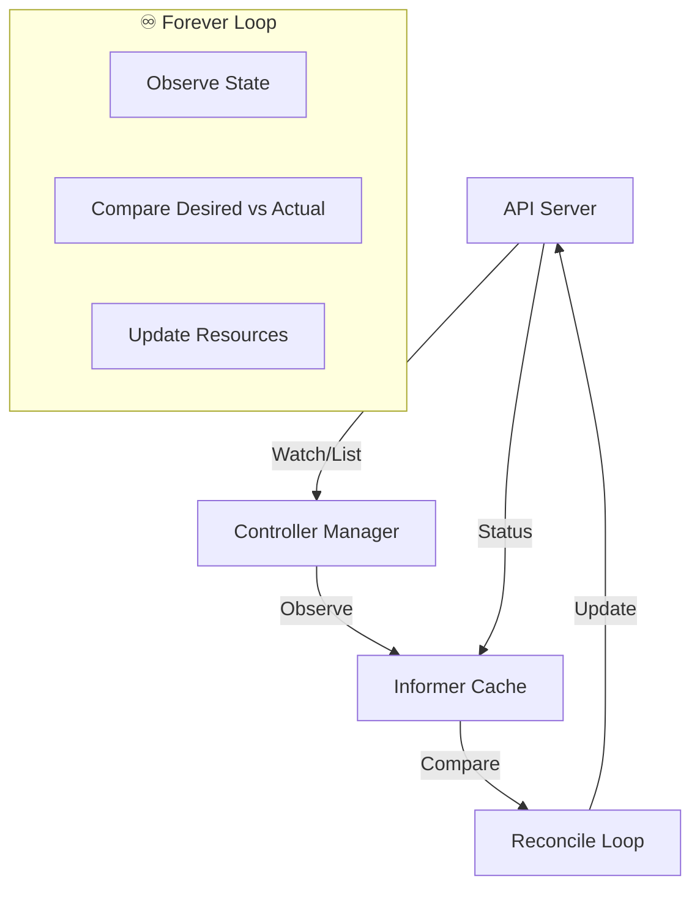
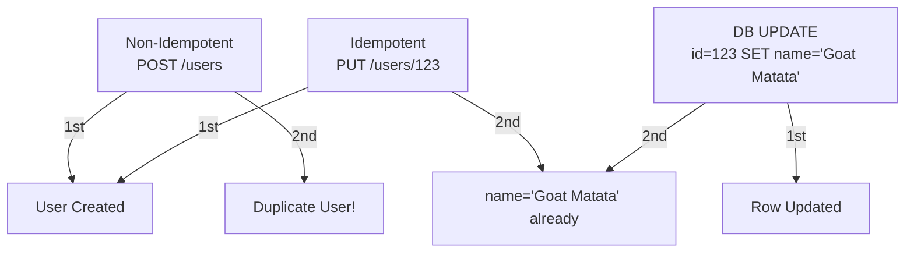
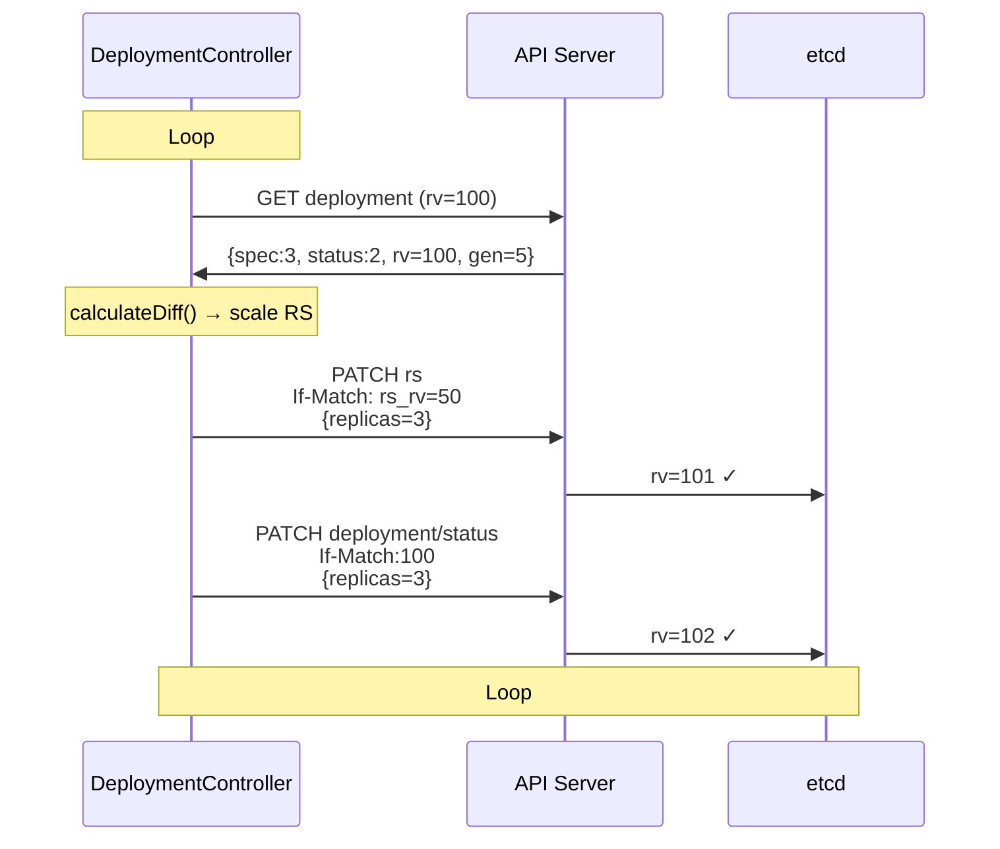
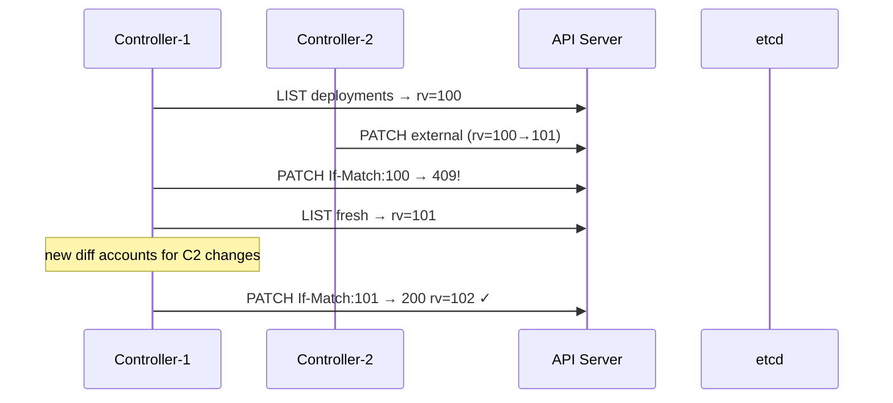
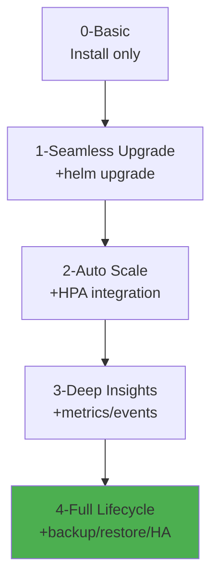

# operators


<div style="text-align: justify;">

## 0. pre-amble

### 0.1. controllers

* **Controllers** are "forever-running" reconciliation loops that continuously monitor and adjust cluster state to match desired state.

* **Kubernetes controller**: A control loop that watches Kubernetes resources (via API server) and makes changes to achieve the desired state specified in manifests. Runs indefinitely using shared `Informer` caches.



* **Pseudo-code** (Controller Pattern):

```go
    for {
        // 1. OBSERVE - Watch/list resources via Informer
        currentState := cache.List("deployments")
        
        // 2. COMPARE - Diff against desired state
        for each deployment in currentState {
            if deployment.Spec.Replicas != deployment.Status.Replicas {
                diff := calculateDiff(deployment.Spec, deployment.Status)
            }
        }
        
        // 3. ACT - Update to match desired
        if diff != nil {
            updateDeployment(deployment.Name, diff)
        }
        
        time.Sleep(reconcileInterval)  // Backoff
    }
```

* **Core Functions**:

```go
    func observe_state(deployment Deployment) {
        if deployment.Generation != deployment.Status.ObservedGeneration {
            log.Info("State changed", "generation", deployment.Generation)
        }
    }

    func compare_states(current, desired Deployment) bool {
        return current.Spec.Replicas != desired.Spec.Replicas ||
            !equal(current.Spec.Template, desired.Spec.Template)
    }

    func update_state(current Deployment, desired Deployment) {
        patch := calculatePatch(current, desired)
        client.Patch(context.TODO(), &desired, patch)
    }
```

* **Idempotency CRITICAL**: Controllers run forever. Must safely handle duplicates, retries, failures.

* **Example**: `Deployment controller` sees `replicas: 3, ready: 2` → creates Pod → next loop sees `ready: 3` → **no action** (idempotent).

* **Controllers in wild**:
- **Deployment controller**: Manages ReplicaSets/Pods
- **GC controller**: Deletes completed Jobs
- **Namespace controller**: Finalizers lifecycle
- **Custom**: ArgoCD, cert-manager, external-dns

### 0.2. idempotency

* **Idempotency**: Operation can be applied multiple times without changing result beyond initial application.

**Simple**: `kubectl apply` 10x = same state. `curl -X POST` 10x = 1 resource.



* **HTTP Methods**:

| Method | Idempotent? | Safe? | Example |
|--------|-------------|-------|---------|
| **GET** | ✅ Yes | ✅ Yes | Read user |
| **HEAD** | ✅ Yes | ✅ Yes | Check exists |
| **PUT** | ✅ Yes | ❌ No | Create/update |
| **PATCH** | ⚠️ Maybe | ❌ No | Partial update |
| **POST** | ❌ No | ❌ No | Create |
| **DELETE** | ✅ Yes | ❌ No | Remove |

* **How it works** (Kubernetes):

```plaintext
    1. Client: kubectl apply -f deployment.yaml
    2. API Server: Check resourceVersion=123456
    3. Controller: Sees replicas=3 (already 3) → NoOp
    4. Client retry: Same resourceVersion → 409 Conflict → apply wins
```

* **Strategies to achieve idempotency**:

#### 0.2.1. client-generated IDs

```go
    // WhatsApp message
    POST /messages
    {
    "idempotency_key": "msg_abc123_20260129T1016",
    "to": "+254712345678",
    "template": "order_confirmation"
    }
```

#### 0.2.2. version checks

```sql
    -- Optimistic locking
    UPDATE orders SET status='shipped', version=version+1 
    WHERE id=123 AND version=5;  -- Affects 1 row or 0
```

#### 0.2.3. conditional requests

```http
    PUT /users/123
    If-Match: "etag:abc123"
    If-None-Match: "etag:def456"
```

#### 0.2.4. UPSERT pattern

```sql
    -- PostgreSQL
    INSERT INTO analytics (event_id, user_id, count)
    VALUES ('evt_123', 456, 1)
    ON CONFLICT (event_id) DO UPDATE SET count = count + 1;
```

* **Strategies to enforce idempotency**:

#### 0.2.4. idempotency keys (Stripe pattern)

```plaintext
    Redis: SETEX idempotency_abc123 {status: "processing"} 3600
    if redis.exists(key): return 200 cached result
    else: process → cache result
```

#### 0.2.5. database constraints

```sql
    CREATE UNIQUE INDEX idx_idempotency ON requests(idempotency_key);
```

#### 0.2.6. distributed locks

```go
    // Process payment
    lock := acquireLock("payment_" + idempotency_key, 5*time.Minute)
    if lock != nil {
        processPayment()
        releaseLock(lock)
    }
```

* **Controller Idempotency Example** (Deployment):

```go
    func reconcileDeployment(deployment *v1.Deployment) {
        // Idempotent: Safe to call 1000x
        if deployment.Spec.Replicas == deployment.Status.Replicas {
            return  // No-op
        }
        
        // Create/update ReplicaSet (idempotent)
        rs := generateReplicaSet(deployment)
        client.CreateOrUpdate(rs)
        
        // Status update (idempotent via resourceVersion)
        deployment.Status.Replicas = currentReplicas
        client.Status().Update(deployment)
    }
```

* **Maths**: Idempotent operation $$f(x) = f(f(x))$$

```plaintext
    f(PUT /users/123) = state_A
    f(f(PUT /users/123)) = state_A  ✅ Idempotent
    g(POST /users) = user1
    g(g(POST /users)) = user2      ❌ Non-idempotent
```

* **Production patterns**:

| Pattern | Use Case | Storage | TTL |
|---------|----------|---------|-----|
| **Idempotency Keys** | API requests | Redis | 24h |
| **ETag/If-Match** | HTTP caching | DB | ∞ |
| **UPSERT** | Analytics | Postgres | ∞ |
| **ResourceVersion** | Kubernetes | etcd | ∞ |

* **Traps**:

```plaintext
    ❌ DELETE /messages/123  -- Gone forever
    ✅ DELETE /messages/123?force=false  -- No-op if missing
```

* **Golden Rule**: **Controllers must be idempotent**. API servers must support idempotency keys. Databases need UPSERT + unique constraints.

```plaintext
    Controllers run forever → must safely handle:
    - Network retries
    - Crashes/restarts  
    - Duplicate reconciles
    - Operator upgrades
```

## 1. idempotency in controllers
* kubernetes controllers achieve idempotency through **resource versioning**, **conditional updates**, **pure functions**, and **etcd's linearisable consistency**
* the reconciliation loop ensures repeated executions converge to the same state: <br/><br/> $\text{reconcile(desired)} = \text{reconcile(reconcile(desired))}$ <br/><br/>
* this handles retries, crashes and duplicates safely

```mermaid
    graph TD
        Client[Client<br/>kubectl apply] -->|Manifest v1| APIServer[API Server<br/>resourceVersion]
        APIServer -->|Watch Event| Informer[Shared Informer<br/>Local Cache]
        Informer -->|Event Queue| Reconciler[Reconcile Function<br/>Pure f(desired)]
        Reconciler -->|StrategicMergePatch<br/>If-Match: rv=123| APIServer
        APIServer -->|409 Conflict| Reconciler
        Reconciler -->|Fresh LIST rv=124| APIServer
        APIServer -->|Status.200 rv=125| Informer
        style Reconciler fill:#e1f5fe,stroke:#01579b
```

* **Core mechanisms**:
    - **resourceVersion**: Monotonic etcd revision prevents lost writes
    - **ObservedGeneration**: Spec hash prevents status churn
    - **Three-way Strategic Merge Patch**: Client/Server/Server-Previous merge
    - **Status subresource**: Read-only separation via `/status` endpoint

* **Real controller code** (from `deployment_controller.go`):

```go
    // kubernetes/pkg/controller/deployment/deployment_controller.go
    func (dc *DeploymentController) reconcileDeployment(key string) error {
        deployment, err := dc.getDeploymentForChange(key)
        if err != nil { return err }
        
        // IDMPOTENT: Pure function of .Spec
        allRSs, err := dc.getReplicaSetsForDeployment(deployment)
        if err != nil { return err }
        
        rsDiff := dc.calculateReplicaSetDiff(deployment, allRSs)
        dc.manageReplicas(deployment, rsDiff)
        
        // Status update - idempotent via resourceVersion
        dc.updateDeploymentStatus(deployment)
        return nil
    }
```

### 1.1. happy path, sad path and Error Handling

#### 1.1.1. happy path

* **happy path**: Desired ≠ Actual → Single-pass reconciliation succeeds

* **Sequence**:



* **Idempotency maths**: $f(\text{Deployment.Spec}) = \text{ReplicaSetConfig}$

```go
    // Pure function example
    func desiredRSConfig(dep *v1.Deployment) *appsv1.ReplicaSet {
        templateHash := hash(dep.Spec.Template)  // SHA256
        return &appsv1.ReplicaSet{
            Labels:        dep.Spec.Selector.MatchLabels,
            TemplateHash:  templateHash,
            Replicas:      dep.Spec.Replicas,
        }
    }
    // f(f(dep)) = f(dep) ✓
```

* **Cert-manager example** (Certificate controller):

```go
    // sigs.k8s.io/controller-runtime pkg/controller
    func (r *CertificateReconciler) Reconcile(ctx context.Context, req ctrl.Request) {
        cert := &cmv1.Certificate{}
        if err := r.Get(ctx, req.NamespacedName, cert); err != nil { return }
        
        // Idempotent: Request cert if !Ready
        if cert.Status.Conditions.Ready() {
            return  // No-op
        }
        
        csr := generateCSR(cert.Spec)
        r.createOrUpdateSecret(csr.SigningCABundle)
    }
```

#### 1.1.2. sad path

* **sad path**: Stale cache + concurrent writes → 409 Conflict → Retry.

* **Detailed flow** (two controllers):



* **Code pattern** (controller-runtime):

```go
    // Exponential backoff + fresh read
    if err := r.Patch(ctx, obj, patch); err != nil {
        if kerrors.IsConflict(err) {
            // Idempotent retry
            return r.Reconcile(ctx, req)  // Fresh LIST
        }
        return reconcile.Result{RequeueAfter: 5 * time.Second}, err
    }
```

* **External-DNS example** (DNS record sync):

```yaml
    # sad path: Network partition → retry safe
    apiVersion: externaldns.k8s.io/v1alpha1
    kind: DNSEndpoint
    spec:
    endpoints:
    - dnsName: app.example.com
        targets: ["1.2.3.4"]
    ---
    # Controller sees Route53=A record exists → No-op
```

* Retry convergence:  <br/><br/> $P(\text{converge after n retries}) = 1 - (1-p)^n$ <br/><br/> where $p$ = prob(fresh read succeeds)

#### 1.1.3. error handling

* **error handling** categorises failures with graceful degradation:

| Error Type | Kubernetes Response | Idempotency Strategy | Example |
|------------|-------------------|---------------------|---------|
| **Transient (500)** | Requeue + Backoff | Safe retry | API timeout |
| **Conflict (409)** | Fresh LIST → Retry | Pure reconcile func | Concurrent update |
| **Validation** | Event + No Requeue | Early return | Invalid spec |
| **NotFound** | Delete finalizer | One-shot cleanup | Resource deleted |

* **Code illustration** (ArgoCD Application controller):

```go
    func (r *AppReconciler) Reconcile(req ctrl.Request) (ctrl.Result, error) {
        app := &appv1.Application{}
        if err := r.Get(ctx, req.NamespacedName, app); errors.IsNotFound(err) {
            return reconcile.Result{}, nil  // Idempotent delete
        }
        
        switch app.Status.Sync.Status {
        case appv1.SyncStatusCodeSynced:
            return reconcile.Result{}, nil  // No-op
        }
        
        if err := r.syncResources(app); err != nil {
            r.recordEvent(app, "Warning", "SyncFailed", err.Error())
            return reconcile.Result{RequeueAfter: 30*time.Second}, nil
        }
        
        // Finalizer cleanup - idempotent
        if app.DeletionTimestamp != nil {
            r.removeFinalizer(app)
        }
        return reconcile.Result{}, nil
    }
```

* **error flow**:

```mermaid
    graph TD
        Reconcile[Reconcile] -->|Patch 500| Backoff[Backoff<br/>workqueue.WithMaxWait(5m)]
        Backoff -->|10 retries| DLQ[DeadLetter<br/>metrics.RecordFailure()]
        Reconcile -->|ValidationError| Event[K8s Event<br/>reason=InvalidSpec]
        Reconcile -->|IsNotFound| Cleanup[Remove Finalizer<br/>One-shot]
        Reconcile -->|LeaderElectionLost| Exit[Exit(0)<br/>HA failover]
        
        style DLQ fill:#ffcdd2
        style Event fill:#fff3e0
```

* **Custom operator depth** - Cert-manager CertificateRequest:

```go
    // Idempotency via CSR serial number + Ready condition
    func reconcileCertRequest(cr *cmv1.CertificateRequest) {
        if cr.Status.Certificate != nil {
            return  // Already issued
        }
        
        csr, err := parseCSR(cr.Spec.CSR)
        if err != nil {
            cr.Status.Conditions.SetFalse(Ready, "CSRParseError")
            return
        }
        
        // Idempotent signer call
        cert, err := ca.Sign(csr, cr.Spec.Duration)
        if err != nil {
            return ctrl.Result{RequeueAfter: 1*time.Minute}, err
        }
        
        cr.Status.Certificate = cert.Raw
        cr.Status.Conditions.MarkTrue(Ready)
    }
```

**Production metrics** (Prometheus):

```plaintext
    controller_runtime_reconcile_total{controller="deployment",result="success"} 1.2k
    controller_runtime_reconcile_total{result="retry"} 23
    controller_runtime_reconcile_total{result="error"} 0
```

* **Golden takeaway**: Idempotency = Pure functions + Versioned writes + Structured retries

## 2. WTF is an operator?

* an **operator** extends Kubernetes with domain-specific controllers that automate complex application lifecycles
* technically, it is a **Custom Resource Definition (CRD) + custom reconciliation controller** that implements the OODA loop (Observe-Orient-Decide-Act) for stateful workloads

* **Mathematical definition**: <br/><br/> $\text{Operator} = \mathcal{C}(\text{CRD}, \text{Reconciler})$ <br/><br/> where <br/> $\mathcal{C}$ is the controller-runtime composition <br/> $\text{CRD}$ defines the declarative API surface <br/> $\text{Reconciler}: \text{CR} \to \text{ClusterState}$ is a pure idempotent function

* think of Kubernetes core controllers as a thermostat (Deployment → Pods)
    * operators are *smart HVAC systems* that also handle maintenance, refrigerant levels and seasonal mode switches for your data centre.

```mermaid
    graph TB
        CoreK8s[Core Controllers<br/>Deployment → Pods] -->|Simple| Stateless
        Operator[Operator = CRD + Controller<br/>MySQL → StatefulSet + Backup + HA] -->|Complex| Stateful
        
        subgraph "Operator Pattern"
            CRD[Custom Resource Definition<br/>apiVersion: mysql.example.com/v1<br/>kind: MySQLCluster]
            Controller[Reconciler<br/>idempotent f(CR) → K8s Resources]
            CRD -.->|Watches| Controller
            Controller -->|Creates| K8sResources[StatefulSets, PVCs, Services, Jobs]
        end
```

* **Core pattern** (operator-sdk):

```go
    // Mathematical: reconcile(CR) = desiredState
    func (r *MySQLReconciler) Reconcile(ctx context.Context, req ctrl.Request) {
        cluster := &mysqlv1.MySQLCluster{}
        if err := r.Get(ctx, req.NamespacedName, cluster); err != nil { return }
        
        // Pure function: CR.Spec → K8s resources
        statefulSet := r.generateStatefulSet(cluster)
        service := r.generateHeadlessService(cluster)
        
        // Idempotent applies
        if err := r.applyResource(statefulSet); err != nil { return }
        if err := r.applyResource(service); err != nil { return }
        
        // Status: observed → CR.Status
        r.updateClusterStatus(cluster)
    }
```

### 2.1. Features of an Operator

* operators provide **declarative automation** beyond core Kubernetes:

| Feature | Description | Mathematical Model |
|---------|-------------|-------------------|
| **Lifecycle Management** | Install, upgrade, backup, scale, failover | \( \text{Lifecycle}(t) = \sum_{s \in \text{states}} P(s\|t) \cdot \text{action}(s) \) |
| **Self-Healing** | Auto-restart, anti-affinity, PDBs | \( \text{Availability} = 1 - \text{MTTR}/\text{MTBF} \) |
| **High Availability** | Leader election, rack-aware | Quorum: \( N = 2f+1 \) (f=failures) |
| **Backup/Restore** | Velero integration, point-in-time | \( \text{RPO} = \text{backupInterval} \) |
| **Metrics/Observability** | Prometheus, custom status | \( \text{SLO} = P(\text{latency} < 99\text{th}) \) |

* **Operator Capability Levels** (OperatorHub):



* **illustration** - MySQL Operator features:

```go
    // Feature: Auto-backup (cronjob)
    func backupJob(cluster *mysqlv1.MySQLCluster) batchv1.CronJob {
        return batchv1.CronJob{
            Schedule: cluster.Spec.Backup.Schedule,  // "0 2 * * *"
            JobTemplate: batchv1.JobTemplateSpec{
                Spec: batchv1.JobSpec{
                    Template: corev1.PodTemplateSpec{
                        Spec: corev1.PodSpec{
                            Containers: []corev1.Container{{
                                Name:  "mysqldump",
                                Image: "mysql:8.0",
                                Command: []string{"mysqldump", 
                                    fmt.Sprintf("--host=%s", cluster.Status.HeadlessService)},
                                VolumeMounts: pvcs(cluster.Spec.Storage),
                            }},
                        },
                    },
                },
            },
        }
    }
```

### 2.2. CRDs and CRs

#### 2.2.1. CRDs

* **CRD** (Custom Resource Definition) extends the Kubernetes API with custom object types

* **Features**:
    - **Schema validation** (OpenAPI v3)
    - **Defaulting/webhooks** (validating, mutating, converting)
    - **Subresources** (`/status`, `/scale`, `/finalizers`)
    - **Printer columns** (kubectl output)
    - **Multiple versions** (v1alpha1 → v1)

* **Create CRD**:

```yaml
    # api/mysql-operator-crd.yaml
    apiVersion: apiextensions.k8s.io/v1
    kind: CustomResourceDefinition
    metadata:
    name: mysqlclusters.mysql.example.com
    spec:
    group: mysql.example.com
    versions:
    - name: v1
        served: true
        storage: true
        schema:
        openAPIV3Schema:
            type: object
            properties:
            spec:
                type: object
                properties:
                replicas:
                    type: integer
                    minimum: 1
                    maximum: 9
                storage:
                    type: object
                    properties:
                    size:
                        type: string
                        pattern: '^\d+[GTM]i$'
    names:
        plural: mysqlclusters
        singular: mysqlcluster
        kind: MySQLCluster
    scope: Namespaced
```

* **Cloud integrations**:

| Provider | Service | CRD Field Example | Controller Action |
|----------|---------|-------------------|------------------|
| **AWS** | RDS, EBS | `storageClass: gp3`, `rds.instanceClass: db.r6g.xlarge` | `eksctl create volume`, RDS API calls |
| **Azure** | AKS, Disks | `storageClass: managed-premium`, `aks.nodepool` | Azure Disk CSI, AKS API |
| **GCP** | GKE, PD | `storageClass: pd-ssd`, `gke.autopilot` | PersistentDisk CSI, GKE API |

* **AWS example** (EBS CSI via operator):

```yaml
    spec:
    storage:
        size: 100Gi
        storageClassName: gp3
        parameters:
        type: gp3
        iops: "3000"
    # Controller → aws-ebs-csi-driver Volume
```

* schema constraint <br>/<br/> $\text{replicas} \in [1,9] \land \text{storage.size} \sim \text{GiBRegex}$ <br/><br/>

#### 2.2.2. CRs

* **CR** (Custom Resource) is an instance of a CRD - your declarative configuration

* **Features**:
    - **.spec**: Desired state (user input)
    - **.status**: Observed state (controller output)
    - **Finalizers**: Cleanup hooks
    - **Annotations/labels**: Metadata
    - **OwnerReferences**: Garbage collection

* **Create CR**:

```yaml
    # Apply after CRD exists
    apiVersion: mysql.example.com/v1
    kind: MySQLCluster
    metadata:
    name: prod-cluster
    finalizers: ["mysql.example.com/finalizer"]
    spec:
    replicas: 3
    version: "8.0.33"
    storage:
        size: 100Gi
        storageClass: gp3-aws
    backup:
        schedule: "0 2 * * *"
        retention: 30
    cloud:
        provider: aws
        region: eu-west-1
    status:
    phase: Running
    replicas: 3/3
    storageProvisioned: true
```

* **Cloud-integrated CR example** (Multi-cloud):

```yaml
    # AWS RDS + EBS
    spec:
    cloudConfig:
        aws:
        rds:
            instanceClass: db.r6g.2xlarge
            backupRetention: 7
        ebs:
            type: gp3
            iops: 3000
    # Azure AKS
        azure:
        diskSku: Premium_LRS
        aksNodePool: Standard_D4s_v5
    # GCP GKE
        gcp:
        pdType: pd-ssd
        gkeMachineType: e2-standard-4
```

* **Controller integration code**:

```go
    // Cloud-agnostic storage provisioning
    func provisionStorage(cr *mysqlv1.MySQLCluster) {
        pvc := &corev1.PersistentVolumeClaim{
            Spec: corev1.PersistentVolumeClaimSpec{
                StorageClassName: &cr.Spec.Storage.StorageClass,
                Resources: corev1.ResourceRequirements{
                    Requests: map[corev1.ResourceName]resource.Quantity{
                        corev1.ResourceStorage: resource.MustParse(cr.Spec.Storage.Size),
                    },
                },
            },
        }
        
        // CSI driver handles AWS/Azure/GCP
        client.Create(pvc)
    }
```

* **kubectl usage**:

```bash
kubectl apply -f mysql-crd.yaml
kubectl apply -f prod-cluster.yaml
kubectl get mysqlcluster prod-cluster -o yaml
# STATUS: phase=Running replicas=3/3
```

* **Garbage collection**:

```plaintext
CR deleted → Finalizer blocks → Controller cleanup → Remove finalizer → Delete
```

</div>
