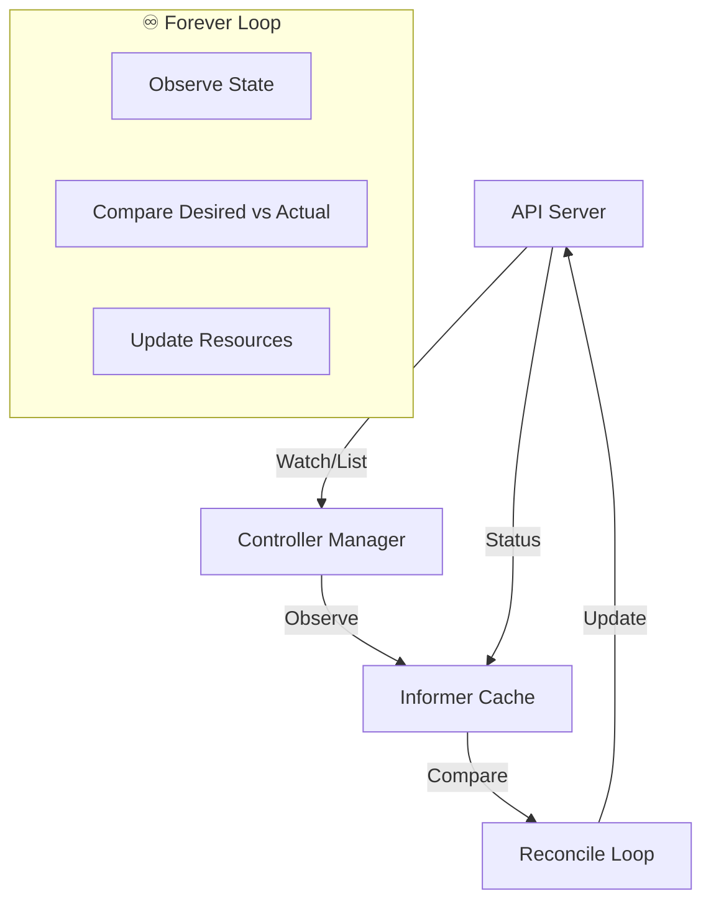
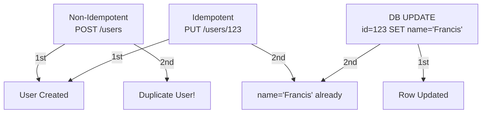

# operators


<div style="text-align: justify;">

## 0. pre-amble

### 0.1. controllers

* **Controllers** are "forever-running" reconciliation loops that continuously monitor and adjust cluster state to match desired state.

* **Kubernetes controller**: A control loop that watches Kubernetes resources (via API server) and makes changes to achieve the desired state specified in manifests. Runs indefinitely using shared `Informer` caches.



* **Pseudo-code** (Controller Pattern):

```go
    for {
        // 1. OBSERVE - Watch/list resources via Informer
        currentState := cache.List("deployments")
        
        // 2. COMPARE - Diff against desired state
        for each deployment in currentState {
            if deployment.Spec.Replicas != deployment.Status.Replicas {
                diff := calculateDiff(deployment.Spec, deployment.Status)
            }
        }
        
        // 3. ACT - Update to match desired
        if diff != nil {
            updateDeployment(deployment.Name, diff)
        }
        
        time.Sleep(reconcileInterval)  // Backoff
    }
```

* **Core Functions**:

```go
    func observe_state(deployment Deployment) {
        if deployment.Generation != deployment.Status.ObservedGeneration {
            log.Info("State changed", "generation", deployment.Generation)
        }
    }

    func compare_states(current, desired Deployment) bool {
        return current.Spec.Replicas != desired.Spec.Replicas ||
            !equal(current.Spec.Template, desired.Spec.Template)
    }

    func update_state(current Deployment, desired Deployment) {
        patch := calculatePatch(current, desired)
        client.Patch(context.TODO(), &desired, patch)
    }
```

* **Idempotency CRITICAL**: Controllers run forever. Must safely handle duplicates, retries, failures.

* **Example**: `Deployment controller` sees `replicas: 3, ready: 2` → creates Pod → next loop sees `ready: 3` → **no action** (idempotent).

* **Controllers in wild**:
- **Deployment controller**: Manages ReplicaSets/Pods
- **GC controller**: Deletes completed Jobs
- **Namespace controller**: Finalizers lifecycle
- **Custom**: ArgoCD, cert-manager, external-dns

### 0.2. idempotency

* **Idempotency**: Operation can be applied multiple times without changing result beyond initial application.

**Simple**: `kubectl apply` 10x = same state. `curl -X POST` 10x = 1 resource.



* **HTTP Methods**:

| Method | Idempotent? | Safe? | Example |
|--------|-------------|-------|---------|
| **GET** | ✅ Yes | ✅ Yes | Read user |
| **HEAD** | ✅ Yes | ✅ Yes | Check exists |
| **PUT** | ✅ Yes | ❌ No | Create/update |
| **PATCH** | ⚠️ Maybe | ❌ No | Partial update |
| **POST** | ❌ No | ❌ No | Create |
| **DELETE** | ✅ Yes | ❌ No | Remove |

* **How it works** (Kubernetes):

```plaintext
    1. Client: kubectl apply -f deployment.yaml
    2. API Server: Check resourceVersion=123456
    3. Controller: Sees replicas=3 (already 3) → NoOp
    4. Client retry: Same resourceVersion → 409 Conflict → apply wins
```

* **Strategies to achieve idempotency**:

#### 0.2.1. client-generated IDs

```go
    // WhatsApp message
    POST /messages
    {
    "idempotency_key": "msg_abc123_20260129T1016",
    "to": "+254712345678",
    "template": "order_confirmation"
    }
```

#### 0.2.2. version checks

```sql
    -- Optimistic locking
    UPDATE orders SET status='shipped', version=version+1 
    WHERE id=123 AND version=5;  -- Affects 1 row or 0
```

#### 0.2.3. conditional requests

```http
    PUT /users/123
    If-Match: "etag:abc123"
    If-None-Match: "etag:def456"
```

#### 0.2.4. UPSERT pattern

```sql
    -- PostgreSQL
    INSERT INTO analytics (event_id, user_id, count)
    VALUES ('evt_123', 456, 1)
    ON CONFLICT (event_id) DO UPDATE SET count = count + 1;
```

* **Strategies to enforce idempotency**:

#### 0.2.4. idempotency keys (Stripe pattern)

```plaintext
    Redis: SETEX idempotency_abc123 {status: "processing"} 3600
    if redis.exists(key): return 200 cached result
    else: process → cache result
```

#### 0.2.5. database constraints

```sql
    CREATE UNIQUE INDEX idx_idempotency ON requests(idempotency_key);
```

#### 0.2.6. distributed locks

```go
    // Process payment
    lock := acquireLock("payment_" + idempotency_key, 5*time.Minute)
    if lock != nil {
        processPayment()
        releaseLock(lock)
    }
```

* **Controller Idempotency Example** (Deployment):

```go
    func reconcileDeployment(deployment *v1.Deployment) {
        // Idempotent: Safe to call 1000x
        if deployment.Spec.Replicas == deployment.Status.Replicas {
            return  // No-op
        }
        
        // Create/update ReplicaSet (idempotent)
        rs := generateReplicaSet(deployment)
        client.CreateOrUpdate(rs)
        
        // Status update (idempotent via resourceVersion)
        deployment.Status.Replicas = currentReplicas
        client.Status().Update(deployment)
    }
```

* **Math**: Idempotent operation $$f(x) = f(f(x))$$

```plaintext
    f(PUT /users/123) = state_A
    f(f(PUT /users/123)) = state_A  ✅ Idempotent
    g(POST /users) = user1
    g(g(POST /users)) = user2      ❌ Non-idempotent
```

* **Production patterns**:

| Pattern | Use Case | Storage | TTL |
|---------|----------|---------|-----|
| **Idempotency Keys** | API requests | Redis | 24h |
| **ETag/If-Match** | HTTP caching | DB | ∞ |
| **UPSERT** | Analytics | Postgres | ∞ |
| **ResourceVersion** | Kubernetes | etcd | ∞ |

* **Traps**:

```plaintext
    ❌ DELETE /messages/123  -- Gone forever
    ✅ DELETE /messages/123?force=false  -- No-op if missing
```

* **Golden Rule**: **Controllers must be idempotent**. API servers must support idempotency keys. Databases need UPSERT + unique constraints.

```plaintext
    Controllers run forever → must safely handle:
    - Network retries
    - Crashes/restarts  
    - Duplicate reconciles
    - Operator upgrades
```

</div>
