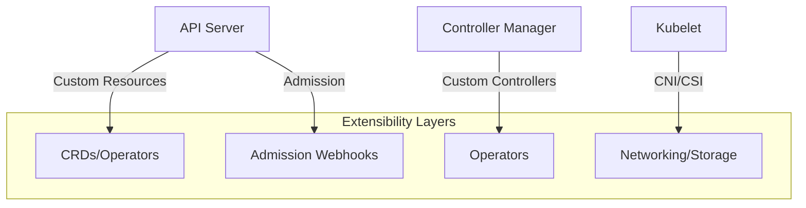
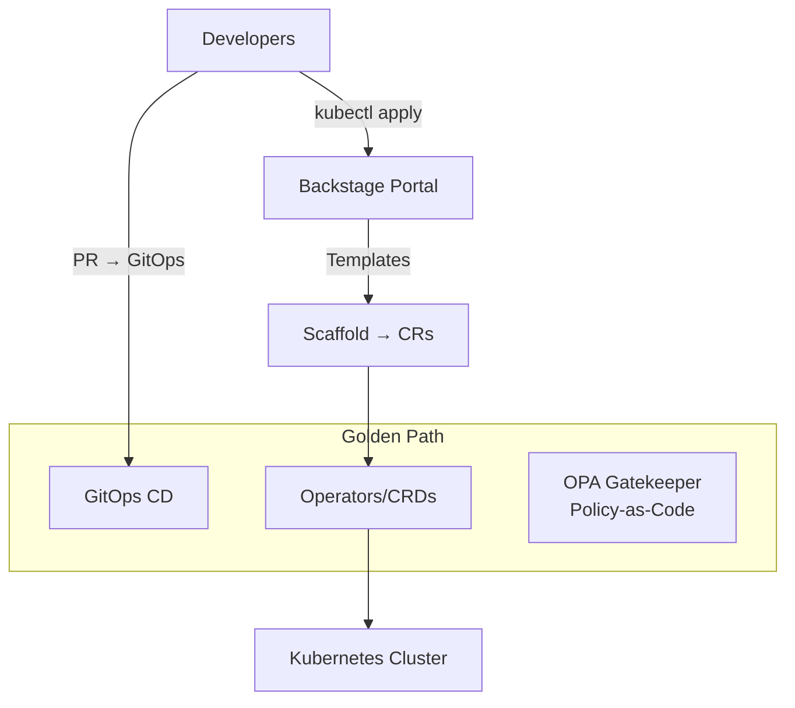
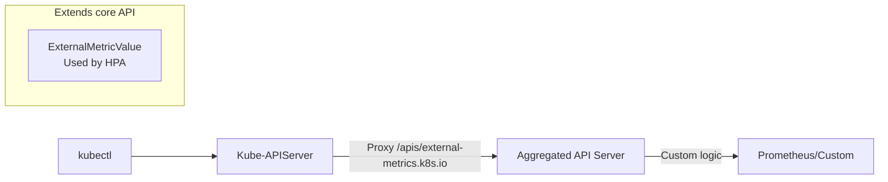
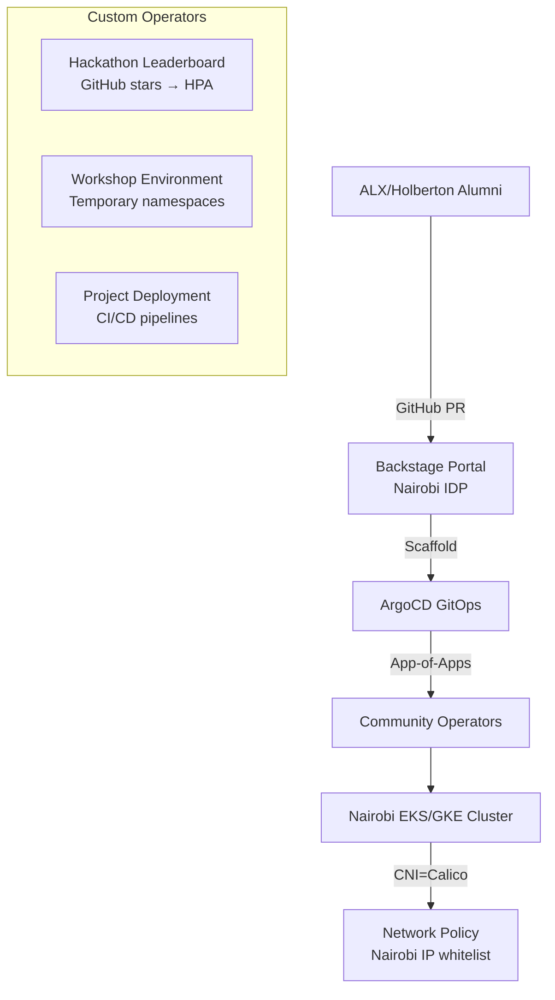

# kubernetes extensibility

<div style="text-align: justify;">

## 0. intro

* kubernetes is more than a container orchestrator—it's an **extensible platform SDK** with hooks at every layer
* you extend it by injecting custom logic into the control plane, data plane, and API surface



### 0.1. Kubernetes as an SDK & Extensibility

* **Kubernetes = Platform SDK**: Clean APIs + pluggable architecture = infinite customisation

* **Core extensibility primitives**:

| Layer | Mechanism | Use Case | Power Level |
|-------|-----------|----------|-------------|
| **API** | CRDs + Aggregated API Servers | Custom objects/operators | 🟢 Highest |
| **Admission** | Mutating/Validating Webhooks | Policy enforcement | 🟡 High |
| **Control Plane** | Custom Controllers | Business logic | 🟢 Highest |
| **Data Plane** | CNI/CSI/EBSI | Networking/storage | 🟠 Medium |
| **Runtime** | Container Runtime Interface (CRI) | containerd/runc | 🔴 Low |

* **SDK philosophy**: Declarative YAML → Controller reconciles → Idempotent state

* **Code pattern** (extensibility example):

```go
    // client-go dynamic client - programmatic extensibility
    dynamicClient, _ := dynamic.NewForConfig(config)
    crdGVR := schema.GroupVersionResource{
        Group:    "mysql.example.com",
        Version:  "v1",
        Resource: "mysqlclusters",
    }

    unstructuredCR, _ := dynamicClient.Resource(crdGVR).Namespace(ns).Get(ctx, "prod", metav1.GetOptions{})
    desiredReplicas := int(*unstructuredCR.Object["spec"].(map[string]interface{})["replicas"].(*int64))
```

### 0.2. Networking, Storage, & Admission Controllers

#### 0.2.1. Networking (CNI)

* **CNI plugins** extend kubelet networking:

```yaml
    # NetworkAttachmentDefinition (Multus)
    apiVersion: k8s.cni.cncf.io/v1
    kind: NetworkAttachmentDefinition
    metadata:
    name: macvlan-conf
    spec:
    config: '{
        "cniVersion": "0.8.2",
        "type": "macvlan",
        "master": "eth0",
        "mode": "bridge",
        "ipam": {"type": "host-local"}
    }'
```

* **Popular CNIs**:

| CNI | Use Case | Extensibility |
|-----|----------|--------------|
| **Calico** | Network policy + BGP | Custom BGP policies |
| **Cilium** | eBPF + Hubble | L7 policies, service mesh |
| **Multus** | Multi-network | Multiple NICs per pod |
| **AWS VPC CNI** | ENI per pod | AWS VPC-native |

#### 0.2.2. Storage (CSI)

* **CSI drivers** replace in-tree volume plugins:

```yaml
    # StorageClass → CSI
    apiVersion: storage.k8s.io/v1
    kind: StorageClass
    metadata:
    name: ebs-gp3
    provisioner: ebs.csi.aws.com
    parameters:
    type: gp3
    iops: "3000"
    ---
    apiVersion: v1
    kind: PersistentVolumeClaim
    spec:
    storageClassName: ebs-gp3
    accessModes: ["ReadWriteOnce"]
    resources:
        requests:
        storage: 100Gi
```

* **Cloud CSI matrix**:

| Provider | CSI Driver | Features |
|----------|------------|----------|
| AWS | `ebs.csi.aws.com` | Snapshots, encryption, topology |
| Azure | `disk.csi.azure.com` | Premium SSD, zone-redundant |
| GCP | `pd.csi.storage.gke.io` | SSD, regional PD |

#### 0.2.3. Admission Controllers

**Admission webhooks** intercept API calls:

```yaml
    # ValidatingWebhookConfiguration
    apiVersion: admissionregistration.k8s.io/v1
    kind: ValidatingWebhookConfiguration
    webhooks:
    - name: mysql-admission.mysql.example.com
    rules:
    - operations: ["CREATE", "UPDATE"]
        apiGroups: ["mysql.example.com"]
        apiVersions: ["v1"]
        resources: ["mysqlclusters"]
    failurePolicy: Fail
    sideEffects: None
    clientConfig:
        service:
        name: mysql-webhook
        namespace: mysql-system
        path: "/validate"
```

* **Webhook code**:

```go
    // Mutating admission
    func (wh *Webhook) mutate(ctx context.Context, req admission.Request) *admission.Response {
        mysqlCluster := mysqlv1.MySQLCluster{}
        yaml.Unmarshal(req.Object.Raw, &mysqlCluster)
        
        // Auto-default replicas=3 if unspecified
        if mysqlCluster.Spec.Replicas == nil {
            mysqlCluster.Spec.Replicas = ptr.To(3)
        }
        
        marshaled, _ := yaml.Marshal(mysqlCluster)
        return &admission.AdmissionResponse{
            Allowed: true,
            Patch:   base64.StdEncoding.EncodeToString(marshaled),
            PatchType: &admission.PatchTypeJsonPatch,
        }
    }
```

### 0.3. Internal Developer Platforms (IDP) & Platform Engineering

* **IDP**: Self-service developer portals built on Kubernetes extensibility

* **Architecture**:



* **IDP stack**:

| Component | Purpose | Extensibility |
|-----------|---------|--------------|
| **Backstage** | Developer portal | Custom plugins/CRD UIs |
| **ArgoCD** | GitOps | Custom ApplicationSets |
| **Gatekeeper** | Policy | Custom OPA policies |
| **Crossplane** | Infrastructure | Compositions → CRDs |

* **Platform engineering example** (Crossplane + AWS):

```yaml
    # Infrastructure CR
    apiVersion: aws.upbound.io/v1beta1
    kind: RDSInstance
    metadata:
    name: prod-db
    spec:
    forProvider:
        engine: "mysql"
        instanceClass: "db.r6g.xlarge"
        allocatedStorage: 100
    providerConfigRef:
        name: aws-provider
```

### 0.4. Bootstrapping with Kubebuilder

* **Kubebuilder**: CLI + scaffolding for CRD + controller development

* **Bootstrap workflow**:

```bash
    # 1. Init project
    kubebuilder init --domain mysql.example.com --repo mysql-operator

    # 2. Create CRD + controller
    kubebuilder create api \
    --group mysql \
    --version v1 \
    --kind MySQLCluster \
    --resource --controller

    # 3. Implement reconciler (auto-generated)
    # api/v1/mysqlcluster_types.go
    type MySQLClusterSpec struct {
        Replicas *int32 `json:"replicas,omitempty"`
        Storage  Storage `json:"storage"`
    }

    # 4. Generate manifests
    make manifests
    make install  # Apply CRDs

    # 5. Run locally
    make run
```

* **Generated structure**:

```plaintext
    mysql-operator/
    ├── api/
    │   └── v1/
    │       ├── mysqlcluster_types.go
    │       └── zz_generated.deepcopy.go
    ├── controllers/
    │   └── mysqlcluster_controller.go
    ├── config/
    │   ├── crd/
    │   └── webhook/
    └── Makefile
```

* **Kubebuilder vs alternatives**:

| Tool | Language | Batteries | Learning Curve |
|------|----------|-----------|----------------|
| **Kubebuilder** | Go | CRDs + Controllers + Webhooks | 🟢 Low |
| **Operator-SDK** | Go/Helm/Ansible | More patterns | 🟡 Medium |
| **Kopf** | Python | Simple controllers | 🟢 Low |

* **Production bootstrap**:

```bash
    # Helm install operator
    helm install mysql-operator ./config/helm/mysql-operator \
    --namespace mysql-system \
    --create-namespace

    # Deploy workload
    kubectl apply -f config/samples/mysql_v1_mysqlcluster.yaml
    kubectl get mysqlcluster
```

## 1.  Advanced Extensibility Patterns

### 1.1. Aggregated APIs & Custom Schedulers

#### 1.1.1. Aggregated API Servers

* **Aggregated APIs** proxy external API servers through kube-apiserver:

```yaml
    # APIService registration
    apiVersion: apiregistration.k8s.io/v1
    kind: APIService
    metadata:
    name: v1beta1.external-metrics.k8s.io
    spec:
    group: external-metrics.k8s.io
    version: v1beta1
    groupPriorityMinimum: 100
    versionPriority: 100
    service:
        name: prometheus-adapter
        namespace: monitoring
    caBundle: <base64-ca-cert>
```

* **Architecture**:



* **Nairobi use case**: Community metrics API for ALX/Holberton hackathon leaderboards.

```go
    // Custom API for hackathon metrics
    // /apis/metrics.alx.ke/v1alpha1/hackathonleaderboards
    type HackathonLeaderboardSpec struct {
        RepoURL   string `json:"repoUrl"`
        Metric    string `json:"metric"`  // stars, forks, contributors
        Namespace string `json:"namespace"`
    }

    type HackathonLeaderboardStatus struct {
        Stars        int    `json:"stars"`
        Contributors []User `json:"contributors"`
        Rank         int    `json:"rank"`
    }
```

#### 1.1.2. Custom Schedulers

* **Custom schedulers** extend pod placement logic:

```yaml
    # Pod with custom scheduler
    apiVersion: v1
    kind: Pod
    metadata:
    name: nairobi-critical-workload
    spec:
    schedulerName: geo-aware-scheduler  # Custom!
    containers: [...]
```

* **Custom scheduler code** (Go):

```go
    // Nairobi geo-aware scheduler
    type GeoAwareScheduler struct {
        client dynamic.Interface
        geodb  *maxminddb.Reader  // IP → Nairobi/London
    }

    func (s *GeoAwareScheduler) Schedule(ctx context.Context, pod *v1.Pod) {
        // Custom predicates
        if pod.Labels["priority"] == "nairobi-critical" {
            nodes := s.nodesInGeo("Africa/Nairobi")
            if len(nodes) > 0 {
                s.bindPod(pod, nodes[0])  // Prefer local nodes
                return
            }
        }
        
        // Fallback to default scheduler
        defaultSchedule(ctx, pod)
    }
```

### 1.2. IDP Case Study: Nairobi Tech Community Platform

* **Scenario**: ALX/Holberton alumni platform for hackathons, workshops, and project deployments.

* **Architecture**:



* **CRDs for community**:

```yaml
    # Hackathon leaderboard auto-scaling
    apiVersion: metrics.alx.ke/v1alpha1
    kind: HackathonLeaderboard
    metadata:
    name: ke-hackathon-2026
    spec:
    repo: "alx-africa/ke-hackathon-2026"
    metric: "github-stars-per-hour"
    minReplicas: 2
    maxReplicas: 20
    targetMetric: 100  # Stars/hour → HPA
    ---
    # Temporary workshop environment
    apiVersion: workshop.alx.ke/v1alpha1
    kind: WorkshopEnvironment
    metadata:
    name: python-data-2026
    spec:
    template: "python-django"
    duration: "72h"
    participants: 50
    resources:
        cpu: "500m"
        memory: "1Gi"
```

* **Platform policies** (Gatekeeper OPA):

```rego
    # Nairobi IP whitelist
    package platform.nairobi

    default allow = false

    allow {
        input.request.userInfo.clientIP[_] == "197.234.219.0/24"  # Safaricom
        or input.request.userInfo.clientIP[_] == "102.88.0.0/16"   # Kenya ISPs
    }

    deny[msg] {
        input.request.kind.kind == "Deployment"
        not input.request.userInfo.username == "alx-admin@ke"
        msg := "Only ALX admins can deploy"
    }
```

* **Metrics dashboard** (community KPIs):

| Metric | Source | Purpose |
|--------|--------|---------|
| `hackathon_stars_total` | GitHub API + Prometheus | Leaderboard |
| `workshop_active_users` | Workshop CR status | Capacity planning |
| `nairobi_pod_locality` | Custom scheduler | Geo-preference |

### 1.3. Kubebuilder Hands-On: MySQL Operator for Nairobi

* **Complete bootstrap**:

```bash
    # 1. Prerequisites
    go install sigs.k8s.io/kubebuilder@latest
    mkdir nairobi-mysql-op && cd nairobi-mysql-op

    # 2. Init + CRD
    kubebuilder init --domain alx.ke --repo nairobi-mysql
    kubebuilder create api --group mysql --version v1 --kind MySQLCluster --resource --controller

    # 3. Edit types (api/v1/mysqlcluster_types.go)
```

* **Custom MySQLCluster spec** (Nairobi-tuned):

```go
    // api/v1/mysqlcluster_types.go
    type MySQLClusterSpec struct {
        Replicas      *int32 `json:"replicas,omitempty"`
        Version       string `json:"version"`
        Storage       StorageSpec `json:"storage"`
        Backup        BackupSpec `json:"backup,omitempty"`
        CloudProvider string    `json:"cloudProvider,omitempty"`  // aws/azure/gcp
        GeoPreference string    `json:"geoPreference,omitempty"`  // nairobi/london
    }

    type StorageSpec struct {
        Size         string `json:"size"`
        StorageClass string `json:"storageClass"`
    }

    type BackupSpec struct {
        Schedule string `json:"schedule"`
        S3Bucket string `json:"s3Bucket,omitempty"`  # Nairobi S3
    }
```

* **Controller implementation** (controllers/mysqlcluster_controller.go):

```go
    func (r *MySQLClusterReconciler) Reconcile(ctx context.Context, req ctrl.Request) {
        cluster := &alxkev1.MySQLCluster{}
        if err := r.Get(ctx, req.NamespacedName, cluster); err != nil { return }
        
        // Nairobi geo-aware storage
        storageClass := r.geoAwareStorageClass(cluster.Spec.GeoPreference)
        
        // StatefulSet (idempotent)
        sts := r.generateStatefulSet(cluster, storageClass)
        if err := r.reconcileResource(ctx, sts); err != nil { return }
        
        // Headless service
        svc := r.generateHeadlessService(cluster)
        if err := r.reconcileResource(ctx, svc); err != nil { return }
        
        // Backup cronjob (S3)
        if cluster.Spec.Backup.S3Bucket != "" {
            cron := r.generateBackupJob(cluster)
            r.reconcileResource(ctx, cron)
        }
        
        // Status update
        cluster.Status.Replicas = sts.Status.Replicas
        r.Status().Update(ctx, cluster)
    }

    func (r *MySQLClusterReconciler) geoAwareStorageClass(geo string) string {
        switch geo {
        case "nairobi":
            return "ebs-gp3-nairobi"  // Local AZ
        default:
            return "gp3"
        }
    }
```

* **Deploy to cluster**:

```bash
    # Generate + install
    make manifests
    make install  # CRDs only

    # Run locally (port-forward apiserver)
    make run

    # Deploy operator
    kubectl apply -f config/manager

    # Test workload
    kubectl apply -f config/samples/mysql_v1_mysqlcluster_nairobi.yaml
```

* **Sample CR** (Nairobi production):

```yaml
    apiVersion: mysql.alx.ke/v1
    kind: MySQLCluster
    metadata:
    name: alx-community-db
    spec:
    replicas: 3
    version: "8.0.35"
    storage:
        size: "50Gi"
        storageClass: "ebs-gp3-nairobi"
    backup:
        schedule: "0 3 * * *"  # 3AM EAT
        s3Bucket: "s3://alx-nairobi-backups"
    cloudProvider: "aws"
    geoPreference: "nairobi"
```

* **Verification**:

```bash
    kubectl get mysqlcluster alx-community-db -o yaml
    # Status: replicas: 3/3, phase: Running, backups: active
```


</div>
