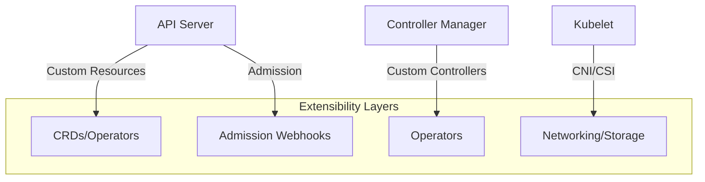
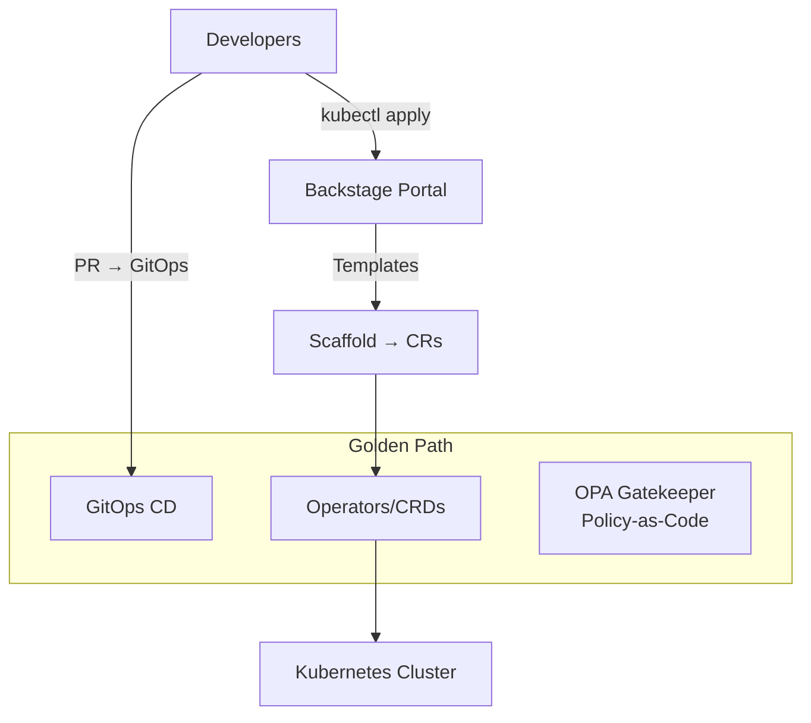

# kubernetes extensibility

<div style="text-align: justify;">

## 0. intro

* kubernetes is more than a container orchestrator—it's an **extensible platform SDK** with hooks at every layer
* you extend it by injecting custom logic into the control plane, data plane, and API surface



### 0.1. Kubernetes as an SDK & Extensibility

* **Kubernetes = Platform SDK**: Clean APIs + pluggable architecture = infinite customisation

* **Core extensibility primitives**:

| Layer | Mechanism | Use Case | Power Level |
|-------|-----------|----------|-------------|
| **API** | CRDs + Aggregated API Servers | Custom objects/operators | 🟢 Highest |
| **Admission** | Mutating/Validating Webhooks | Policy enforcement | 🟡 High |
| **Control Plane** | Custom Controllers | Business logic | 🟢 Highest |
| **Data Plane** | CNI/CSI/EBSI | Networking/storage | 🟠 Medium |
| **Runtime** | Container Runtime Interface (CRI) | containerd/runc | 🔴 Low |

* **SDK philosophy**: Declarative YAML → Controller reconciles → Idempotent state

* **Code pattern** (extensibility example):

```go
    // client-go dynamic client - programmatic extensibility
    dynamicClient, _ := dynamic.NewForConfig(config)
    crdGVR := schema.GroupVersionResource{
        Group:    "mysql.example.com",
        Version:  "v1",
        Resource: "mysqlclusters",
    }

    unstructuredCR, _ := dynamicClient.Resource(crdGVR).Namespace(ns).Get(ctx, "prod", metav1.GetOptions{})
    desiredReplicas := int(*unstructuredCR.Object["spec"].(map[string]interface{})["replicas"].(*int64))
```

### 0.2. Networking, Storage, & Admission Controllers

#### 0.2.1. Networking (CNI)

* **CNI plugins** extend kubelet networking:

```yaml
    # NetworkAttachmentDefinition (Multus)
    apiVersion: k8s.cni.cncf.io/v1
    kind: NetworkAttachmentDefinition
    metadata:
    name: macvlan-conf
    spec:
    config: '{
        "cniVersion": "0.8.2",
        "type": "macvlan",
        "master": "eth0",
        "mode": "bridge",
        "ipam": {"type": "host-local"}
    }'
```

* **Popular CNIs**:

| CNI | Use Case | Extensibility |
|-----|----------|--------------|
| **Calico** | Network policy + BGP | Custom BGP policies |
| **Cilium** | eBPF + Hubble | L7 policies, service mesh |
| **Multus** | Multi-network | Multiple NICs per pod |
| **AWS VPC CNI** | ENI per pod | AWS VPC-native |

#### 0.2.2. Storage (CSI)

* **CSI drivers** replace in-tree volume plugins:

```yaml
    # StorageClass → CSI
    apiVersion: storage.k8s.io/v1
    kind: StorageClass
    metadata:
    name: ebs-gp3
    provisioner: ebs.csi.aws.com
    parameters:
    type: gp3
    iops: "3000"
    ---
    apiVersion: v1
    kind: PersistentVolumeClaim
    spec:
    storageClassName: ebs-gp3
    accessModes: ["ReadWriteOnce"]
    resources:
        requests:
        storage: 100Gi
```

* **Cloud CSI matrix**:

| Provider | CSI Driver | Features |
|----------|------------|----------|
| AWS | `ebs.csi.aws.com` | Snapshots, encryption, topology |
| Azure | `disk.csi.azure.com` | Premium SSD, zone-redundant |
| GCP | `pd.csi.storage.gke.io` | SSD, regional PD |

#### 0.2.3. Admission Controllers

**Admission webhooks** intercept API calls:

```yaml
    # ValidatingWebhookConfiguration
    apiVersion: admissionregistration.k8s.io/v1
    kind: ValidatingWebhookConfiguration
    webhooks:
    - name: mysql-admission.mysql.example.com
    rules:
    - operations: ["CREATE", "UPDATE"]
        apiGroups: ["mysql.example.com"]
        apiVersions: ["v1"]
        resources: ["mysqlclusters"]
    failurePolicy: Fail
    sideEffects: None
    clientConfig:
        service:
        name: mysql-webhook
        namespace: mysql-system
        path: "/validate"
```

* **Webhook code**:

```go
    // Mutating admission
    func (wh *Webhook) mutate(ctx context.Context, req admission.Request) *admission.Response {
        mysqlCluster := mysqlv1.MySQLCluster{}
        yaml.Unmarshal(req.Object.Raw, &mysqlCluster)
        
        // Auto-default replicas=3 if unspecified
        if mysqlCluster.Spec.Replicas == nil {
            mysqlCluster.Spec.Replicas = ptr.To(3)
        }
        
        marshaled, _ := yaml.Marshal(mysqlCluster)
        return &admission.AdmissionResponse{
            Allowed: true,
            Patch:   base64.StdEncoding.EncodeToString(marshaled),
            PatchType: &admission.PatchTypeJsonPatch,
        }
    }
```

### 0.3. Internal Developer Platforms (IDP) & Platform Engineering

* **IDP**: Self-service developer portals built on Kubernetes extensibility

* **Architecture**:



* **IDP stack**:

| Component | Purpose | Extensibility |
|-----------|---------|--------------|
| **Backstage** | Developer portal | Custom plugins/CRD UIs |
| **ArgoCD** | GitOps | Custom ApplicationSets |
| **Gatekeeper** | Policy | Custom OPA policies |
| **Crossplane** | Infrastructure | Compositions → CRDs |

* **Platform engineering example** (Crossplane + AWS):

```yaml
    # Infrastructure CR
    apiVersion: aws.upbound.io/v1beta1
    kind: RDSInstance
    metadata:
    name: prod-db
    spec:
    forProvider:
        engine: "mysql"
        instanceClass: "db.r6g.xlarge"
        allocatedStorage: 100
    providerConfigRef:
        name: aws-provider
```

### 0.4. Bootstrapping with Kubebuilder

* **Kubebuilder**: CLI + scaffolding for CRD + controller development

* **Bootstrap workflow**:

```bash
    # 1. Init project
    kubebuilder init --domain mysql.example.com --repo mysql-operator

    # 2. Create CRD + controller
    kubebuilder create api \
    --group mysql \
    --version v1 \
    --kind MySQLCluster \
    --resource --controller

    # 3. Implement reconciler (auto-generated)
    # api/v1/mysqlcluster_types.go
    type MySQLClusterSpec struct {
        Replicas *int32 `json:"replicas,omitempty"`
        Storage  Storage `json:"storage"`
    }

    # 4. Generate manifests
    make manifests
    make install  # Apply CRDs

    # 5. Run locally
    make run
```

* **Generated structure**:

```plaintext
    mysql-operator/
    ├── api/
    │   └── v1/
    │       ├── mysqlcluster_types.go
    │       └── zz_generated.deepcopy.go
    ├── controllers/
    │   └── mysqlcluster_controller.go
    ├── config/
    │   ├── crd/
    │   └── webhook/
    └── Makefile
```

* **Kubebuilder vs alternatives**:

| Tool | Language | Batteries | Learning Curve |
|------|----------|-----------|----------------|
| **Kubebuilder** | Go | CRDs + Controllers + Webhooks | 🟢 Low |
| **Operator-SDK** | Go/Helm/Ansible | More patterns | 🟡 Medium |
| **Kopf** | Python | Simple controllers | 🟢 Low |

* **Production bootstrap**:

```bash
    # Helm install operator
    helm install mysql-operator ./config/helm/mysql-operator \
    --namespace mysql-system \
    --create-namespace

    # Deploy workload
    kubectl apply -f config/samples/mysql_v1_mysqlcluster.yaml
    kubectl get mysqlcluster
```

</div>
