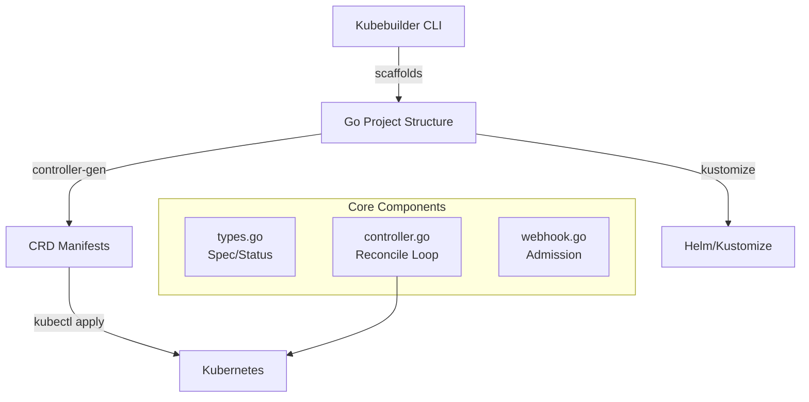

# setting Up the Local Environment

<div style="text-align: justify;">

## 0. building Operators with Kubebuilder: Hands-On Lab

### 0.1. K3D + Docker Setup

* **K3D** runs Kubernetes in Docker; great for operator development.

```bash
    # 1. Install prerequisites (Ubuntu/Debian)
    curl -fsSL https://get.docker.com | sudo sh
    sudo usermod -aG docker $USER && newgrp docker

    # 2. K3D cluster (multi-node for realism)
    k3d cluster create nairobi-operator-lab \
    --agents 2 \
    --servers 1 \
    --port '8080:80@loadbalancer' \
    --k3s-arg "--enable=traefik@server:0" \
    --k3s-arg "cluster-init=false@server:*"

    # 3. Verify
    kubectl cluster-info
    kubectl get nodes
    # Ready nodes: nairobi-operator-lab-server-0, agents
```

* **Storage setup** (local provisioner for testing):

```bash
    # Install local-path-provisioner
    kubectl apply -f https://raw.githubusercontent.com/rancher/local-path-provisioner/v0.0.28/deploy/local-path-storage.yaml

    # Nairobi-optimised StorageClass
    cat <<EOF | kubectl apply -f -
    apiVersion: storage.k8s.io/v1
    kind: StorageClass
    metadata:
    name: nairobi-local-fast
    provisioner: rancher.io/local-path
    reclaimPolicy: Delete
    volumeBindingMode: WaitForFirstConsumer
    EOF
```

### 0.2. kubebuilder Installation

```bash
    # Go 1.22+ required
    go version  # >=1.22

    # Install Kubebuilder v3.15+
    go install sigs.k8s.io/kubebuilder/v3/cmd/kubebuilder@latest
    sudo cp $GOPATH/bin/kubebuilder /usr/local/bin/

    # Verify
    kubebuilder version
    # version: "3.15.0"
```

* **Complete toolchain**:
```bash
    # Controller-tools for codegen
    go install sigs.k8s.io/controller-tools/cmd/controller-gen@latest

    # Kustomize
    curl -s "https://raw.githubusercontent.com/kubernetes-sigs/kustomize/master/hack/install_kustomize.sh" | bash

    # Cert-manager (for webhooks)
    kubectl apply -f https://github.com/cert-manager/cert-manager/releases/download/v1.15.3/cert-manager.yaml
```

## 1. kubebuilder Framework Introduction

* **Kubebuilder** = `CRD generator + controller-runtime scaffolding + Makefiles`

* **Architecture**:



* **Magic**: Generates 90% boilerplate; you write business logic

### 1.1. project Initialisation

```bash
    # Create operator project
    mkdir nairobi-mysql-operator && cd nairobi-mysql-operator
    kubebuilder init --domain alx.ke --repo github.com/yourusername/nairobi-mysql

    # Create CRD + controller
    kubebuilder create api \
    --group mysql \
    --version v1 \
    --kind MySQLCluster \
    --resource \
    --controller \
    --crud  # Generate client methods
```

* **Generated structure**:

```plaintext
    nairobi-mysql-operator/
    ├── api/                    # CRD types
    │   └── v1/
    │       ├── groupversion_info.go
    │       ├── mysqlcluster_types.go
    │       └── zz_generated.deepcopy.go
    ├── controllers/            # Reconciler logic
    │   └── mysqlcluster_controller.go
    ├── config/                 # Deploy manifests
    │   ├── crd/
    │   ├── default/
    │   ├── manager/
    │   └── webhook/
    ├── Dockerfile
    ├── Makefile                # Magic commands
    └── main.go                 # Entry point
```

## 2. exploring the Scaffolding

### 2.1. Makefiles - The Magic

* **Makefile targets**:

```makefile
    # Core workflow
    .PHONY: manifests
    manifests: controller-gen ## Generate WebhookConfiguration, Manifests and CRDs
        $(CONTROLLER_GEN) rbac:roleName=manager-role crd:trivialVersions=true \
            webhook paths="./..." output:crd:artifacts:config=config/crd/bases

    .PHONY: install
    install: manifests kustomize ## Install CRDs into the K8s cluster specified in ~/.kube/config
        $(KUSTOMIZE) build config/crd | kubectl apply -f -

    .PHONY: run
    run: manifests generate fmt vet ## Run a controller from your host
        go run ./main.go

    .PHONY: docker-build
    docker-build: test ## Build container image
        docker build -t ${IMG} .
```

* **Usage flow**:

```bash
    make manifests    # Generate CRDs
    make install      # kubectl apply CRDs  
    make run          # Run controller locally
```

### 2.2. Dockerfiles - Multi-stage Production

```dockerfile
    # Dockerfile (auto-generated, production-optimised)
    # Build the manager binary
    FROM golang:1.22 as builder
    WORKDIR /workspace
    COPY go.mod go.sum ./
    RUN go mod download
    COPY . .
    RUN CGO_ENABLED=0 GOOS=linux GOARCH=amd64 go build -a -o manager main.go

    # Deploy container
    FROM gcr.io/distroless/static:nonroot
    WORKDIR /
    COPY --from=builder /workspace/manager .
    USER 65532:65532
    ENTRYPOINT ["/manager"]
```

* **Build + push**:

```bash
    IMG=ghcr.io/yourusername/nairobi-mysql:latest make docker-build docker-push
```

### 2.3. main.go - Manager Pattern

* **Entry point** (controller-runtime manager):

```go
    // main.go - Production-ready bootstrap
    package main

    import (
        "context"
        "flag"
        "os"
        
        "k8s.io/apimachinery/pkg/runtime"
        ctrl "sigs.k8s.io/controller-runtime"
        "sigs.k8s.io/controller-runtime/pkg/healthz"
        "sigs.k8s.io/controller-runtime/pkg/log/zap"
        
        alxkev1 "github.com/yourusername/nairobi-mysql/api/v1"
        "github.com/yourusername/nairobi-mysql/controllers"
    )

    var (
        scheme   = runtime.NewScheme()
        setupLog = ctrl.Log.WithName("setup")
    )

    func init() {
        alxkev1.AddToScheme(scheme)
    }

    func main() {
        var metricsAddr string
        var enableLeaderElection bool
        flag.StringVar(&metricsAddr, "metrics-addr", ":8080", "The address the metric endpoint binds to")
        flag.BoolVar(&enableLeaderElection, "enable-leader-election", false,
            "Enable leader election for controller manager")
        opts := zap.Options{
            Development: true,
        }
        ctrl.SetLogger(zap.New(zap.UseFlagOptions(&opts)))
        
        mgr, err := ctrl.NewManager(ctrl.GetConfigOrDie(), ctrl.Options{
            Scheme:                 scheme,
            MetricsBindAddress:     metricsAddr,
            Port:                   9443,
            HealthProbeBindAddress: ":8081",
            LeaderElection:         enableLeaderElection,
            LeaderElectionID:       "nairobi-mysql.alx.ke",
        })
        if err != nil { panic(err) }
        
        if err = (&controllers.MySQLClusterReconciler{
            Client: mgr.GetClient(),
            Scheme: mgr.GetScheme(),
        }).SetupWithManager(mgr); err != nil { panic(err) }
        
        if err := mgr.AddHealthzCheck("healthz", healthz.Ping); err != nil { panic(err) }
        
        setupLog.Info("starting manager")
        if err := mgr.Start(context.TODO()); err != nil { panic(err) }
    }
```

* **Production features** :
- ✅ Leader election (HA)
- ✅ Metrics endpoint (`/metrics`)
- ✅ Health checks (`/healthz`)
- ✅ Secure webhook port (9443)

## 3. First Deploy; Test the Scaffolding

```bash
    # 1. Install CRDs
    make install

    # 2. Run controller (watch logs)
    make run

    # Terminal 2: Create test resource
    kubectl apply -f config/samples/mysql_v1_mysqlcluster.yaml

    # Terminal 3: Watch reconciliation
    kubectl get mysqlcluster -w
```

* **Expected output**:

```plaintext
    $ kubectl get mysqlcluster
    NAME               AGE
    mysqlcluster-sample   10s

    $ kubectl logs deployment/nairobi-mysql-controller-manager -n nairobi-mysql-system -f
    {"level":"info","msg":"MySQLCluster alx.ke/myclusters \"mysqlcluster-sample\" reconciled"}
```

***

* we have a running operator environment

## 4. Version control and other stuff

* **Commit your progress** on github:

```bash
    git init
    git add .
    git commit -m "feat: bootstrap nairobi-mysql-operator with kubebuilder"
    git remote add origin git@github.com:brk-a/nairobi-mysql-operator.git
    git push -u origin main
```

* **Verification checklist**:
- [x] K3D cluster running
- [x] Kubebuilder project scaffolded
- [x] CRDs installed (`kubectl get crd mysqlclusters.mysql.alx.ke`)
- [x] Controller running with logs
- [x] Test MySQLCluster created

</div>
